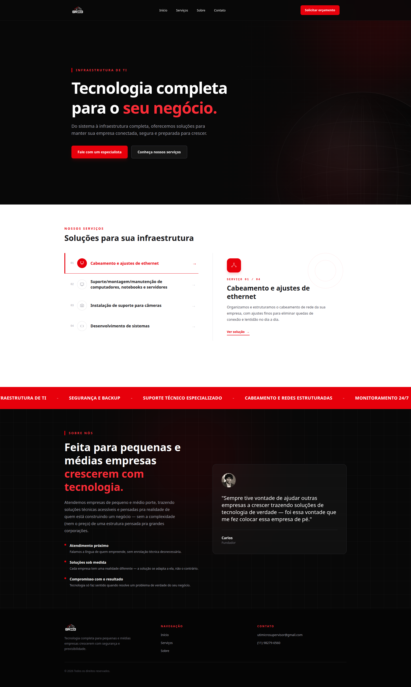

# GridNetworks — Site de Infraestrutura de TI

Site corporativo para a **GridNetworks**, empresa de infraestrutura de TI que atende pequenas e médias empresas com serviços de cabeamento, suporte de equipamentos, instalação de câmeras e desenvolvimento de sistemas.

- **Site ao vivo:** https://gridnetworks.com.br/
- **Deploy (Vercel):** https://cliente-real-site-infra-ti.vercel.app/
- **Tecnologia:** React 18 + Vite + Tailwind CSS v4

---



## Contexto do projeto

O cliente ( Carlos, fundador da GridNetworks ) precisou de um site que apresentasse os serviços da empresa de forma clara, com foco em captação de leads via WhatsApp e comunicação direta com pequenas e médias empresas. O portal deve transmitir credibilidade, mostrar os quatro serviços principais, e deixar o contato facilmente acessível.

---

## O que foi entregue

- **Identidade visual e estrutura:** layout escuro com toques de destaque vermelho, tipografia hierarquizada e navegação fixa.
- **Seções principais:**
  - Hero com headline, descrição e CTAs de contato e serviços.
  - Serviços com cards interativos e abertura do WhatsApp com mensagem pré-definida por serviço.
  - Sobre a empresa com proposta de valor.
  - Footer e botão flutuante de WhatsApp.
- **Acessibilidade básica:** navegação com teclado, suporte a foco, `aria-label` em componentes interativos, menu mobile responsivo.
- **Integração com WhatsApp:** cada serviço e o contato geral abrem conversas com mensagens pré-configuradas, reduzindo atrito no primeiro contato.
- **Responsividade:** adaptação para mobile, tablet e desktop.
- **Animações leves:** glow e grid no hero, reveal conforme scroll, para dar dinamismo sem comprometer performance.

---

## Stack

- **React 18** — UI componentizada, estado local com `useState`/`useEffect`.
- **Vite** — build e desenvolvimento com HMR.
- **Tailwind CSS v4** — estilos utilitários com `@tailwindcss/vite`.
- **CSS customizado** — keyframes e estilos do globo abstrato no `index.css`.
- **Deploy:** Vercel.

---

## Componentes principais

```
src/
├── App.jsx                 # Orquestra as seções da página
├── NavBar.jsx              # Navbar fixa + menu mobile
├── Services.jsx            # Lista de serviços com cards e WhatsApp
├── AboutSection.jsx        # Seção "Sobre nós"
├── Footer.jsx              # Rodapé
├── Button.jsx              # Botão reutilizável
├── WhatsAppButton.jsx      # Botão flutuante de WhatsApp
├── SectionLabel.jsx        # Label de seção
├── Reveal.jsx              # Animação de entrada ao scroll
├── DarkGlow.jsx            # Efeito de brilho no hero
├── AbstractGlobe.jsx       # Decorativo do hero
├── InfiniteBanner.jsx      # Banner decorativo da seção de serviços
├── assets/
│   └── logo.png
├── index.css               # Tailwind + animações customizadas
├── main.jsx                # Entry point
├── navLinks.js             # Links da navegação
└── whatsapp.js             # Constantes e helpers de link do WhatsApp
```

---

## Decisões técnicas

- **React sem rotas:** site é single-page, sem necessidade de router. Isso simplifica o deploy e mantém o foco na entrega do conteúdo.
- **Tailwind v4 + Vite:** configuração moderna com plugin oficial, sem CSS extra desnecessário.
- **WhatsApp como principal canal de conversão:** o negócio atua com orçamentos via WhatsApp, então os CTAs foram direcionados a esse canal com mensagens pré-definidas por serviço.
- **Estado local:** o componente `Services` usa `useState` para destacar o serviço ativo e renderizar o card de detalhe correspondente.

---

## Como rodar localmente

Requisitos: Node.js (versão compatível com o lockfile atual).

```bash
# 1. Entrar na pasta do projeto
cd ClienteCarlos/GridNetworks

# 2. Instalar dependências
npm install

# 3. Iniciar servidor de desenvolvimento
npm run dev
```

O site ficará disponível no endereço informado pelo Vite (geralmente `http://localhost:5173`).

---

## Implantação

O site está publicado via Vercel. Qualquer atualização no `main` que seja empurrada ao repositório aciona a reimplantação. O domínio `gridnetworks.com.br` está configurado para apontar para a implantação em produção.

---

## Autor

Samuel Arcanjo — Front-end Developer (React, JavaScript, HTML, CSS, Tailwind CSS)

- GitHub: https://github.com/SamukaArcanjo
- LinkedIn: https://www.linkedin.com/in/samuel-arcanjo-bonete-silveira-3a2ba5274/
